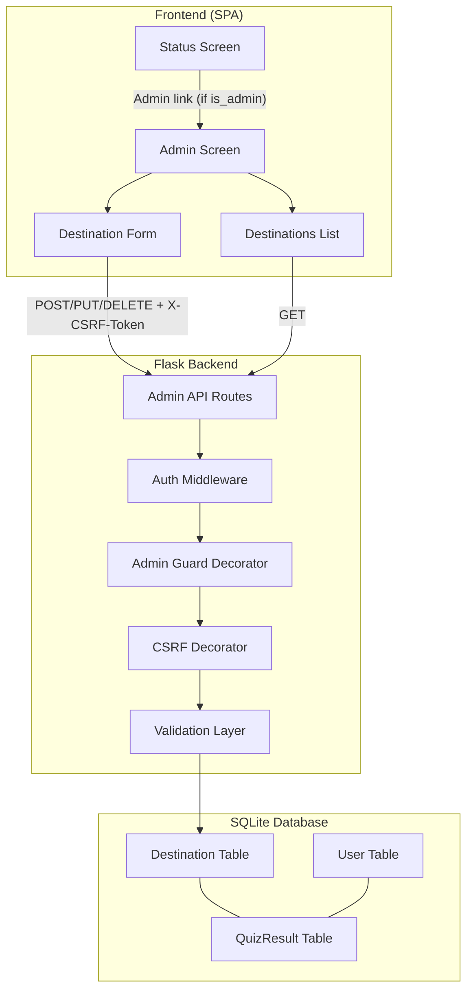
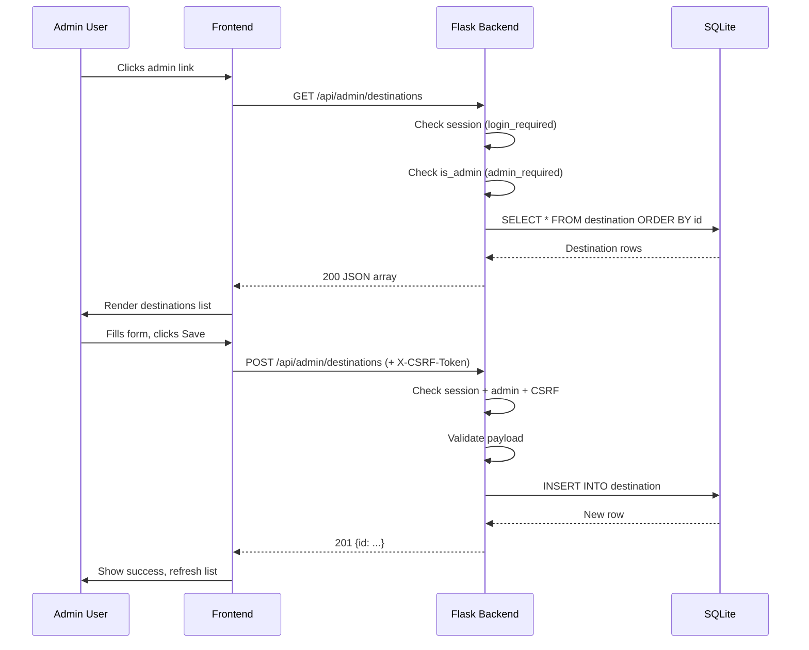

# Design Document: Admin Quiz Management

## Overview

This design adds an admin interface to the Travel Quizzer application, enabling designated admin users to perform full CRUD operations on quiz destinations. The feature introduces:

1. An `is_admin` field on the `User` model for role-based access control
2. A set of REST API endpoints for destination management, protected by authentication, admin authorization, and CSRF token validation
3. A new frontend screen (`adminScreen`) integrated into the existing single-page application, accessible only to admin users via a navigation link on the status screen

The design preserves the existing architecture patterns: Flask + SQLAlchemy backend, session-based authentication, CSRF protection via `X-CSRF-Token` header, and vanilla HTML/JS/CSS frontend with screen toggling.

## Architecture



### Request Flow



## Components and Interfaces

### Backend Components

#### 1. `admin_required` Decorator

A new decorator that wraps `login_required` and additionally checks `current_user.is_admin`. Returns 403 if the user lacks admin privileges.

```python
def admin_required(fn):
    @wraps(fn)
    @login_required
    def wrapper(*args, **kwargs):
        user = get_current_user()
        if not user.is_admin:
            return jsonify({"error": "Admin access required"}), 403
        return fn(*args, **kwargs)
    return wrapper
```

#### 2. Admin API Routes

| Method | Endpoint | Auth | CSRF | Description |
|--------|----------|------|------|-------------|
| GET | `/api/admin/destinations` | admin_required | No | List all destinations |
| GET | `/api/admin/destinations/<id>` | admin_required | No | Get single destination |
| POST | `/api/admin/destinations` | admin_required | Yes | Create destination |
| PUT | `/api/admin/destinations/<id>` | admin_required | Yes | Update destination |
| DELETE | `/api/admin/destinations/<id>` | admin_required | Yes | Delete destination |

#### 3. Validation Layer

A pure function `validate_destination_payload(data)` that validates all fields according to requirements:

- `name`: 1–128 characters, non-blank
- `hints`: exactly 5, each 1–256 characters, non-blank
- `images`: 2–10 URLs, each starting with `http://` or `https://`
- `correct_answers`: 1–20 items, each 1–128 characters

Returns a tuple `(is_valid: bool, errors: list[str])`. On failure, errors describe which fields failed and why.

#### 4. Answer Normalization

A pure function `normalize_answers(answers: list[str]) -> list[str]` that lowercases and trims each answer string before storage.

### Frontend Components

#### 1. Admin Screen (`adminScreen`)

A new `<div id="adminScreen" class="screen hidden">` added to `index.html` containing:
- A header with "Admin: Quiz Management" title and a "Back to Status" link
- A destination count display
- A destinations list (table/list of ID + name + edit/delete buttons)
- An "Add New Destination" button
- An empty-state message when no destinations exist
- Error display area

#### 2. Destination Form Modal/Section

A form section for creating/editing destinations:
- Name input (text, max 128)
- Five hint textareas (max 256 each)
- Dynamic image URL list (add/remove, min 2, max 10)
- Dynamic correct answers list (add/remove, min 1, max 20)
- Save and Cancel buttons
- Client-side validation feedback

#### 3. Confirmation Dialog

A simple confirm dialog (using `window.confirm` or a custom modal) shown before deletion, displaying the destination name.

#### 4. Admin Navigation Link

Conditionally rendered on the status screen when `quizState.user.isAdmin` is true.

## Data Models

### User Model (Modified)

```python
class User(db.Model):
    __tablename__ = 'user'

    id = db.Column(db.Integer, primary_key=True)
    password_hash = db.Column(db.String(256), nullable=False)
    name = db.Column(db.String(128), nullable=False)
    email = db.Column(db.String(128), nullable=False, unique=True)
    is_admin = db.Column(db.Boolean, nullable=False, default=False)  # NEW

    results = db.relationship('QuizResult', back_populates='user', cascade='all, delete-orphan')
```

### Destination Model (Unchanged)

The existing `Destination` model already supports all required fields:
- `name` (String 128)
- `hint1`–`hint5` (String 256 each)
- `images` (JSON array)
- `correct_answers` (JSON array)

### API Request/Response Schemas

#### Create/Update Destination Request Body

```json
{
  "name": "Paris",
  "hints": [
    "This city is known as the City of Light",
    "It has a famous iron lattice tower",
    "The Louvre museum is located here",
    "It sits on the Seine river",
    "Capital of France"
  ],
  "images": [
    "https://example.com/paris1.jpg",
    "https://example.com/paris2.jpg"
  ],
  "correct_answers": ["paris", "paris, france"]
}
```

#### List Destinations Response

```json
{
  "destinations": [
    {"id": 1, "name": "Paris"},
    {"id": 2, "name": "Tokyo"}
  ],
  "count": 2
}
```

#### Get Single Destination Response

```json
{
  "id": 1,
  "name": "Paris",
  "hints": [
    "This city is known as the City of Light",
    "It has a famous iron lattice tower",
    "The Louvre museum is located here",
    "It sits on the Seine river",
    "Capital of France"
  ],
  "images": [
    "https://example.com/paris1.jpg",
    "https://example.com/paris2.jpg"
  ],
  "correct_answers": ["paris", "paris, france"]
}
```

#### Error Response

```json
{
  "error": "Validation failed",
  "details": ["name: must be between 1 and 128 characters"]
}
```

### Login Response (Modified)

The existing `/api/login` and `/api/me` endpoints will include the `is_admin` field:

```json
{
  "id": 1,
  "name": "Admin User",
  "email": "admin@example.com",
  "isAdmin": true,
  "csrfToken": "abc123..."
}
```


## Correctness Properties

*A property is a characteristic or behavior that should hold true across all valid executions of a system—essentially, a formal statement about what the system should do. Properties serve as the bridge between human-readable specifications and machine-verifiable correctness guarantees.*

### Property 1: Unauthenticated requests are rejected

*For any* admin API endpoint, when called without an authenticated session, the response SHALL be 401 Unauthorized.

**Validates: Requirements 1.3**

### Property 2: Non-admin users are rejected

*For any* admin API endpoint and *for any* authenticated user where `is_admin` is false, the response SHALL be 403 Forbidden.

**Validates: Requirements 1.2**

### Property 3: Destination list is complete and ordered

*For any* set of destinations in the database, the GET list endpoint SHALL return all destinations ordered by ID ascending, with the `count` field equal to the number of destinations returned.

**Validates: Requirements 3.1, 3.2**

### Property 4: Destination validation accepts valid and rejects invalid payloads

*For any* destination payload, if the payload satisfies all constraints (name 1–128 non-blank chars, exactly 5 hints each 1–256 non-blank chars, 2–10 image URLs each starting with `http://` or `https://`, 1–20 correct answers each 1–128 chars), the validation SHALL pass. If any constraint is violated, the validation SHALL fail with a descriptive error identifying the invalid field.

**Validates: Requirements 4.2, 4.3, 5.4, 8.1, 8.2, 8.3**

### Property 5: Answer normalization

*For any* list of answer strings provided during creation or update, the stored `correct_answers` JSON array SHALL contain the same strings lowercased and stripped of leading/trailing whitespace.

**Validates: Requirements 4.5, 5.6**

### Property 6: Duplicate name detection

*For any* destination name that already exists in the database, attempting to create a new destination with the same name SHALL return 409 Conflict.

**Validates: Requirements 4.6**

### Property 7: Update round-trip

*For any* existing destination and *for any* valid update payload, after a successful PUT the subsequent GET for that destination SHALL return the updated values exactly as submitted (with answers normalized).

**Validates: Requirements 5.2**

### Property 8: Delete cascades to quiz results

*For any* destination that has associated quiz results, after a successful DELETE, both the destination row and all associated quiz_result rows SHALL no longer exist in the database.

**Validates: Requirements 6.2**

### Property 9: CSRF protection on write endpoints

*For any* admin write endpoint (POST, PUT, DELETE), when called without a valid CSRF token in the `X-CSRF-Token` header, the response SHALL be 403 Forbidden regardless of other valid credentials.

**Validates: Requirements 7.1**

## Error Handling

### Backend Error Responses

| Scenario | Status Code | Response Body |
|----------|-------------|---------------|
| Not authenticated | 401 | `{"error": "Authentication required"}` |
| Not admin | 403 | `{"error": "Admin access required"}` |
| Missing/invalid CSRF token | 403 | `{"error": "Invalid or missing CSRF token"}` |
| Validation failure | 400 | `{"error": "Validation failed", "details": [...]}` |
| Destination not found | 404 | `{"error": "Destination not found"}` |
| Duplicate name | 409 | `{"error": "A destination with this name already exists"}` |
| Server error | 500 | `{"error": "Internal server error"}` |

### Frontend Error Handling

- **Network failures**: Display a generic "Could not connect to server" error banner on the admin screen
- **4xx responses**: Parse the error response and display the message/details to the user inline near the relevant form field or at the top of the form
- **5xx responses**: Display "Something went wrong. Please try again later." with a retry option
- **Optimistic state**: The frontend does NOT perform optimistic updates. It waits for server confirmation before modifying the displayed list.

### Validation Error Display

Client-side validation runs first to provide immediate feedback (highlight fields, show inline messages). Server-side validation errors from 400 responses are parsed and mapped back to their respective fields.

## Testing Strategy

### Unit Tests

- **Validation function**: Test specific valid/invalid payloads including edge cases (exactly at length limits, empty strings, whitespace-only strings, boundary counts for images and answers)
- **Answer normalization**: Test specific cases (mixed case, leading/trailing spaces, already normalized)
- **Admin decorator**: Test that it returns 403 for non-admin users and passes through for admin users
- **API endpoints**: Test each endpoint with Flask test client, verifying response codes and bodies for create, read, update, delete operations
- **Duplicate name detection**: Test creating two destinations with the same name
- **Cascade delete**: Test that deleting a destination removes associated quiz_result rows

### Property-Based Tests

Property-based testing is appropriate for this feature because the validation layer and normalization functions are pure functions with large input spaces where edge cases matter.

**Library**: [Hypothesis](https://hypothesis.readthedocs.io/) (Python)

**Configuration**: Minimum 100 iterations per property test.

**Properties to implement**:

1. **Feature: admin-quiz-management, Property 4: Destination validation** — Generate random payloads (both valid and invalid) and verify the validation function correctly accepts/rejects them.
2. **Feature: admin-quiz-management, Property 5: Answer normalization** — Generate random strings with mixed whitespace and casing, verify normalization produces lowercase trimmed output.
3. **Feature: admin-quiz-management, Property 7: Update round-trip** — Generate valid destination data, create it, update with new valid data, verify GET returns the updated values.

### Integration / E2E Tests

- **Auth flow**: Login as admin, verify admin link appears, navigate to admin page
- **CRUD flow**: Create destination → verify in list → edit → verify changes → delete → verify removal
- **Access control**: Verify non-admin users cannot see admin link or access admin endpoints
- **CSRF protection**: Verify write operations fail without token

### Test Organization

```
test_unit/
  test_admin_validation.py    # Validation function unit tests
  test_admin_api.py           # API endpoint tests with Flask test client
  test_admin_properties.py    # Property-based tests (Hypothesis)
test_e2e/
  test_admin.py               # Playwright E2E tests for admin UI
```
