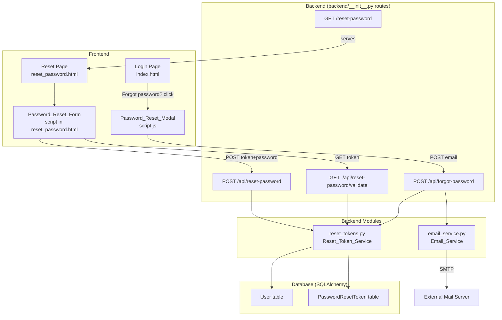

# Design Document: Forgot Password

## Overview

This document describes the technical design for adding a "Forgot Password" flow to the Travel Quizzer application. Users who have forgotten their password can request a time-limited reset link delivered to their registered email address. The flow is presented as a modal overlay on the existing login page, and password reset is completed via a dedicated page served at a new route.

The feature adds two new backend modules (`reset_tokens.py` and `email_service.py`), a new SQLAlchemy model (`PasswordResetToken`), four new API endpoints, one new HTML page, and incremental additions to `script.js` and `index.html`. It deliberately avoids introducing new frontend frameworks or build tools — consistent with the project's vanilla JS approach.

### Key design decisions

- **Token stored as hash, not plaintext**: The raw token is sent in the email URL; only its SHA-256 hash is stored in the database. This protects users if the database is compromised.
- **Constant-time responses for unknown emails**: The endpoint always returns `{"message": "If that email is registered, a reset link has been sent."}` regardless of whether the email exists, to prevent user enumeration.
- **Single-use, 15-minute tokens**: Each token is invalidated immediately after use, and all prior unused tokens for a user are invalidated when a new one is issued.
- **Session invalidation on reset**: Resetting a password clears all session data for the affected user, preventing session fixation.
- **Helpers in dedicated modules**: Following project convention — routes stay in `backend/__init__.py`, business logic lives in `backend/reset_tokens.py` and `backend/email_service.py`.

---

## Architecture



The existing `login_required` / `admin_required` / `csrf_protected` decorators are **not** applied to the new reset endpoints — these routes must be publicly accessible (they are used before the user is authenticated). Rate limiting is applied via `flask-limiter`, consistent with the existing `/api/login` pattern.

---

## Components and Interfaces

### Backend: `backend/reset_tokens.py` (Reset_Token_Service)

Encapsulates all token lifecycle logic. No Flask imports — pure business logic operating on the SQLAlchemy session, making it straightforwardly testable.

```python
def generate_token(user: User) -> str:
    """Create a new reset token for user, invalidate prior tokens, persist record.
    Returns the raw (unhashed) token string."""

def validate_token(raw_token: str) -> PasswordResetToken | None:
    """Validate a raw token. Returns the PasswordResetToken record if valid
    (not expired, not consumed); returns None otherwise."""

def consume_token(token_record: PasswordResetToken, new_password: str) -> None:
    """Update user's password hash, mark token consumed, clear user sessions."""
```

`generate_token` uses `secrets.token_urlsafe(32)` (≥256 bits of entropy), hashes the result with `hashlib.sha256`, stores the hash, and deletes all existing unused tokens for that user before inserting the new one.

`validate_token` hashes the incoming raw token, queries `PasswordResetToken` by hash, and returns `None` for any of: no match, `consumed = True`, `expires_at < datetime.utcnow()`.

`consume_token` calls `werkzeug.security.generate_password_hash` on the new password, updates `user.password_hash`, sets `token_record.consumed = True`, and clears session data by rotating any server-side session stores. Because this project uses Flask's cookie-based sessions (client-side), "invalidating sessions" means inserting a per-user `session_version` counter in the `User` model — login and session validation check this counter; bumping it on password reset invalidates all outstanding cookies. (Alternative: store a `password_changed_at` timestamp checked against the session's `logged_in_at` value — simpler and avoids a new column.)

**Session invalidation approach**: Store `password_changed_at` as a UTC timestamp on the `User` model. On every authenticated request, `get_current_user()` checks that `session.get('logged_in_at', 0) >= user.password_changed_at.timestamp()`. At login, `logged_in_at` is written into the session. On password reset, `password_changed_at` is set to `datetime.utcnow()`, immediately invalidating all older sessions.

### Backend: `backend/email_service.py` (Email_Service)

Encapsulates SMTP email sending. Reads configuration from environment variables at call time (not at import time), so tests can set env vars freely.

```python
def send_password_reset_email(to_address: str, reset_url: str) -> None:
    """Send a password reset email. Raises EmailServiceError on failure."""
```

`EmailServiceError` is a custom exception defined in this module, carrying a human-readable `reason` string. The route handler catches it, logs it, and returns a 500 JSON response.

SMTP configuration env vars: `SMTP_HOST`, `SMTP_PORT` (int, 1–65535), `SMTP_USERNAME`, `SMTP_PASSWORD`, `SMTP_FROM_ADDRESS`, `SMTP_USE_TLS` (optional, `"true"` enables TLS via `smtplib.SMTP_SSL`; any other value uses plain `smtplib.SMTP` with a 10-second timeout).

Email body contains:
- Subject: `"Travel Quizzer — Password Reset Request"`
- Body (plain text): the reset URL, expiry notice ("This link expires in 15 minutes."), and a note that the user can ignore the email if they did not request a reset.

### Backend: New API Routes (in `backend/__init__.py`)

**`POST /api/forgot-password`**

Rate-limited: 3 per email per hour (by email field in body) and 10 per IP per hour.

```
Request:  { "email": "<address>" }
Response 200: { "message": "If that email is registered, a reset link has been sent." }
Response 400: { "error": "Email is required." }
           or { "error": "Invalid email format." }
Response 429: { "error": "Too many requests. Please try again later." }
Response 500: { "error": "Failed to send reset email. Please try again later." }
```

Always returns 200 for valid-format emails, whether or not the user exists, to prevent enumeration. The SMTP failure path returns 500 so the frontend can tell the user to retry.

**`GET /api/reset-password/validate?token=<token>`**

Used by the reset form page on load to verify the token before showing the form.

```
Response 200: { "valid": true }
Response 400: { "error": "Invalid or expired reset link." }
```

**`POST /api/reset-password`**

```
Request:  { "token": "<raw_token>", "password": "<new_password>" }
Response 200: { "message": "Your password has been reset. You may now log in." }
Response 400: { "error": "Token is required." }
           or { "error": "Password is required." }
           or { "error": "Password must be between 8 and 128 characters." }
           or { "error": "Invalid or expired reset link." }
Response 500: { "error": "An unexpected error occurred. Please try again." }
```

**`GET /reset-password`**

Serves `frontend/reset_password.html` — the dedicated reset form page.

### Frontend: `Password_Reset_Modal` (additions to `script.js` and `index.html`)

A `<div id="forgotPasswordModal">` overlay is added to `index.html`, hidden by default. The modal contains:
- An `<h2>` heading "Reset your password"
- An email `<input>` (`id="resetEmail"`, `maxlength="100"`)
- An inline error `<span>` (`id="resetEmailError"`)
- A "Submit" `<button>` and a "Cancel" `<button>`

New JS functions in `script.js`:
- `openForgotPasswordModal()` — shows the modal, sets focus on the email input
- `closeForgotPasswordModal()` — hides the modal, returns focus to the "Forgot password?" link
- `handleForgotPasswordSubmit()` — validates, calls `POST /api/forgot-password`, shows confirmation or error

A "Forgot password?" link (`<a href="#" id="forgotPasswordLink">`) is added below the login form in the welcome screen.

Focus trapping: On `keydown` within the modal, Tab/Shift+Tab cycles focus among: the email input, Submit button, Cancel button. Escape key calls `closeForgotPasswordModal()`.

### Frontend: `Password_Reset_Form` (`frontend/reset_password.html`)

A standalone HTML page served at `GET /reset-password?token=<token>`. It is not part of the SPA — it is a separate `.html` file served directly by Flask via the new `GET /reset-password` route.

On `DOMContentLoaded`:
1. Extract `token` from `window.location.search`.
2. Call `GET /api/reset-password/validate?token=<token>`.
3. If valid: show the reset form (new password + confirm password inputs, submit button).
4. If invalid/expired: show error message with a link back to the login page.

Form validation on submit:
- Both fields non-empty
- `newPassword.length >= 8`
- `newPassword === confirmPassword`
- Password strength indicator (reuses `getPasswordStrength()` from `script.js`, either via a shared module pattern or by inlining the function in the page's script)

On successful `POST /api/reset-password`: show success message with a "Back to login" link (navigates to `/`).

---

## Data Models

### New model: `PasswordResetToken` (in `backend/models.py`)

```python
class PasswordResetToken(db.Model):
    __tablename__ = 'password_reset_token'

    id = db.Column(db.Integer, primary_key=True)
    user_id = db.Column(db.Integer, db.ForeignKey('user.id'), nullable=False, index=True)
    token_hash = db.Column(db.String(64), nullable=False, unique=True, index=True)
    created_at = db.Column(db.DateTime, nullable=False)
    expires_at = db.Column(db.DateTime, nullable=False)
    consumed = db.Column(db.Boolean, nullable=False, default=False)

    user = db.relationship('User', backref=db.backref('reset_tokens', cascade='all, delete-orphan'))
```

`token_hash` is a hex-encoded SHA-256 digest (64 characters). `expires_at = created_at + timedelta(minutes=15)`.

### Changes to `User` model

Add one column:

```python
password_changed_at = db.Column(db.DateTime, nullable=True, default=None)
```

This timestamp is set to `datetime.utcnow()` when a password reset completes. `get_current_user()` in `backend/__init__.py` is updated to compare `session.get('logged_in_at')` against this value and return `None` (forcing re-login) if the session predates the password change.

### Token lifecycle

```
generate_token(user)
  → DELETE existing unused tokens for user_id
  → raw = secrets.token_urlsafe(32)
  → hash = sha256(raw.encode()).hexdigest()
  → INSERT PasswordResetToken(user_id, token_hash=hash, created_at=now, expires_at=now+15m, consumed=False)
  → return raw

validate_token(raw)
  → hash = sha256(raw.encode()).hexdigest()
  → record = PasswordResetToken.query.filter_by(token_hash=hash, consumed=False).first()
  → if record is None OR record.expires_at < utcnow(): return None
  → return record

consume_token(record, new_password)
  → user.password_hash = generate_password_hash(new_password)
  → user.password_changed_at = utcnow()
  → record.consumed = True
  → db.session.commit()
```

---

## Correctness Properties

*A property is a characteristic or behavior that should hold true across all valid executions of a system — essentially, a formal statement about what the system should do. Properties serve as the bridge between human-readable specifications and machine-verifiable correctness guarantees.*

After reflecting on the prework analysis, the following redundancies were eliminated:
- Requirements 2.6 (≥128 bits entropy) is subsumed by 1.1 (≥32 bytes = 256 bits); combined into Property 1.
- Requirements 2.7 (invalidate prior tokens on new generation) duplicates 1.3; combined into Property 2.
- Requirement 2.3 (mark consumed) and 3.7 (mark consumed after reset) are both covered by Property 3 (consumed token rejection round-trip).
- Requirements 3.4 and 3.6 (invalid password 400) are subsumed by Property 5 (password length boundary).

### Property 1: Token uniqueness and entropy

*For any* two independently generated reset tokens, the raw token strings SHALL be distinct, and each token SHALL be URL-safe and at least 64 characters long (representing ≥256 bits of entropy from `secrets.token_urlsafe(32)`).

**Validates: Requirements 1.1, 2.6**

### Property 2: New token invalidates all prior unused tokens

*For any* user and any sequence of k ≥ 2 consecutive token generation calls for that user, after the k-th generation only the k-th token SHALL pass validation; all prior (k-1) tokens SHALL be rejected.

**Validates: Requirements 1.3, 2.7**

### Property 3: Consumed token is rejected on reuse

*For any* valid (non-expired) token that has been used to reset a password, any subsequent validation attempt with the same token SHALL return an invalid/expired result — indistinguishable from an expired token.

**Validates: Requirements 2.2, 2.3, 3.7**

### Property 4: Token hash stored, not plaintext

*For any* generated reset token, the value stored in the `token_hash` column SHALL NOT equal the raw token string, and SHALL equal the hex-encoded SHA-256 digest of the raw token.

**Validates: Requirements 2.5**

### Property 5: Password length boundary enforcement

*For any* string with length < 8 or length > 128, submitting it as the new password to `POST /api/reset-password` SHALL return a 400 response. *For any* string with length between 8 and 128 inclusive, it SHALL be accepted (given a valid token).

**Validates: Requirements 3.3, 3.4, 3.6**

### Property 6: Password reset hash correctness

*For any* new password string of valid length (8–128 characters), after a successful password reset the stored `password_hash` on the user record SHALL satisfy `check_password_hash(user.password_hash, new_password) == True`.

**Validates: Requirements 3.1**

### Property 7: Email body contains required elements

*For any* (raw token, reset base URL) pair, the email constructed by `Email_Service` SHALL have a subject containing the phrase "password reset", SHALL contain the reset URL with the token as a query parameter, and SHALL contain the phrase "15 minutes".

**Validates: Requirements 4.4**

### Property 8: Invalid email format returns 400

*For any* string that is not a valid email address (no `@`, no dot in domain, empty local part, or empty string), submitting it to `POST /api/forgot-password` SHALL return a 400 response.

**Validates: Requirements 1.6, 1.7**

---

## Error Handling

| Scenario | Response | Notes |
|---|---|---|
| Email missing or empty | 400 `{"error": "Email is required."}` | Fail-fast at boundary |
| Email format invalid | 400 `{"error": "Invalid email format."}` | Checked with `_EMAIL_RE` before any DB work |
| Email not registered | 200 (same as success) | Prevents user enumeration |
| Rate limit exceeded | 429 `{"error": "Too many requests. Please try again later."}` | flask-limiter |
| SMTP misconfiguration / timeout | 500 `{"error": "Failed to send reset email. Please try again later."}` + server log | EmailServiceError caught in route |
| SMTP delivery rejection | 500 same as above | SMTPException caught |
| Token missing from request | 400 `{"error": "Token is required."}` | |
| Token invalid / expired / consumed | 400 `{"error": "Invalid or expired reset link."}` | Indistinguishable responses |
| Password missing | 400 `{"error": "Password is required."}` | |
| Password too short or too long | 400 `{"error": "Password must be between 8 and 128 characters."}` | |
| Unexpected DB error during reset | 500 `{"error": "An unexpected error occurred. Please try again."}` + server log | |

All error responses follow the existing `{"error": "message"}` convention. All 500 errors are logged with the specific failure reason before returning a generic message to the client.

---

## Testing Strategy

This feature is tested with a combination of unit tests, property-based tests, and end-to-end tests. The property-based testing library is **Hypothesis** (already used in this project for `test_backend/test_stats_properties.py` and `test_backend/test_pbt_json_roundtrip.py`).

### Unit tests (`test_backend/test_forgot_password.py`)

- Happy path: `POST /api/forgot-password` with a registered email generates a token, sends an email (SMTP mocked), returns 200.
- Unknown email: returns the same 200 success response as a registered email.
- `GET /api/reset-password/validate` with a valid token returns `{"valid": true}`.
- `GET /api/reset-password/validate` with expired, consumed, or unknown token returns 400.
- `POST /api/reset-password` happy path: password updated, token consumed, session invalidated.
- `POST /api/reset-password` with expired/consumed/unknown token: 400.
- Session invalidation: session created before reset is rejected after reset.
- SMTP failure: 500 response, error logged.
- Rate limiting: 4th request from same email within window returns 429.

### Property-based tests (`test_backend/test_pbt_forgot_password.py`)

Each property-based test runs with `@settings(max_examples=100, deadline=5000)`. All tests use in-memory SQLite and mock SMTP.

**Property 1 — Token uniqueness and entropy**
`# Feature: forgot-password, Property 1: Token uniqueness and entropy`
Generate 10 tokens per test run; verify all are distinct, URL-safe, and ≥64 chars.

**Property 2 — New token invalidates prior tokens**
`# Feature: forgot-password, Property 2: New token invalidates all prior unused tokens`
For a generated user, generate k ∈ [2, 5] tokens sequentially; verify only the last is valid.

**Property 3 — Consumed token rejected on reuse**
`# Feature: forgot-password, Property 3: Consumed token is rejected on reuse`
Generate a token, consume it via `consume_token()`, call `validate_token()` again; verify `None` returned.

**Property 4 — Token hash stored, not plaintext**
`# Feature: forgot-password, Property 4: Token hash stored, not plaintext`
Generate a token; query `PasswordResetToken` by `user_id`; verify `token_hash == sha256(raw).hexdigest()` and `token_hash != raw`.

**Property 5 — Password length boundary enforcement**
`# Feature: forgot-password, Property 5: Password length boundary enforcement`
Use `st.text(min_size=0, max_size=7)` (too short) and `st.text(min_size=129)` (too long) to verify 400. Use `st.text(min_size=8, max_size=128)` to verify acceptance.

**Property 6 — Password reset hash correctness**
`# Feature: forgot-password, Property 6: Password reset hash correctness`
For any `st.text(min_size=8, max_size=128)` new password, call `consume_token()`; read back `user.password_hash`; verify `check_password_hash(hash, password)`.

**Property 7 — Email body contains required elements**
`# Feature: forgot-password, Property 7: Email body contains required elements`
For any `st.text()` token and `st.from_regex(r'https?://[a-z0-9.]+')` base URL, call the email construction helper; verify subject contains "password reset", body contains token in URL, body contains "15 minutes".

**Property 8 — Invalid email format returns 400**
`# Feature: forgot-password, Property 8: Invalid email format returns 400`
Use `st.one_of(st.just(""), st.text(max_size=50).filter(lambda s: "@" not in s))` to generate invalid emails; verify 400 response.

### End-to-end tests (`test_e2e/test_forgot_password.py`)

- "Forgot password?" link is visible on the login screen.
- Clicking it opens the modal without navigating away.
- Submitting empty email shows inline error, no request sent.
- Submitting valid email shows confirmation message.
- Escape key closes modal and returns focus to the link.
- Tab key traps focus within the modal.
- Navigating to `/reset-password?token=<invalid>` shows the "link is no longer valid" message.
- Navigating to `/reset-password?token=<valid>` shows the password form.
- Submitting mismatched passwords shows inline error.
- Successfully resetting password shows success message and login link.

### Frontend unit tests (`test_frontend/spec/forgotPasswordSpec.js`)

- `getPasswordStrength` reuse: same strength levels returned on reset form as on registration form.
- Inline validation: mismatched passwords produce correct error message.
- Empty/whitespace-only password rejected before submission.
