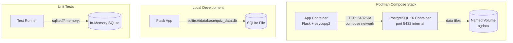
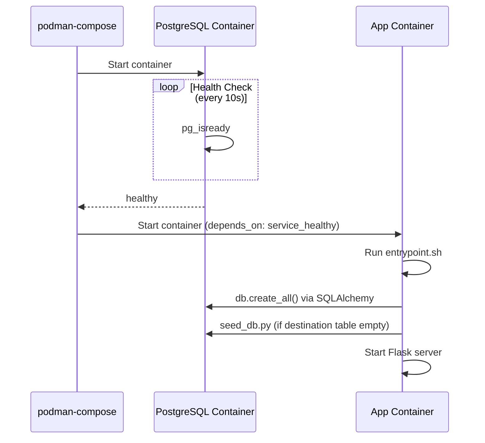

# Design Document: PostgreSQL Migration

## Overview

This design describes the migration of Travel Quizzer's database backend from SQLite to PostgreSQL. PostgreSQL will run as a containerized service alongside the existing Flask application, orchestrated via `podman-compose`. The migration leverages SQLAlchemy's database abstraction so that existing models, queries, and application logic remain unchanged. The key changes are:

1. A new PostgreSQL 16 container in the compose stack
2. Adding `psycopg2-binary` as a dependency
3. Updating environment variable configuration to point at the PostgreSQL instance
4. Removing the embedded SQLite database from the container image
5. Ensuring the seed script and test suite continue to work seamlessly

The existing fallback to SQLite for local development (without containers) is preserved.

## Architecture

### Service Startup Sequence

### Database URI Resolution

The application resolves the database URI using a priority chain:

1. `QUIZ_DATABASE_URL` environment variable (if set and non-empty)
2. `DATABASE_URL` environment variable (if set and non-empty)
3. Default: `sqlite:///database/quiz_data.db` (relative to project root)

This allows the compose stack to inject `QUIZ_DATABASE_URL` for PostgreSQL, while local development and unit tests can override or fall through to SQLite.

## Components and Interfaces

### 1. PostgreSQL Container Service (`podman-compose.yml`)

**Responsibilities:**
- Run PostgreSQL 16 as a service within the compose stack
- Provide a health check so dependent services wait for readiness
- Persist data in a named volume

**Configuration:**
- Image: `postgres:16`
- Internal port: 5432 (not published to host)
- Environment: `POSTGRES_DB`, `POSTGRES_USER`, `POSTGRES_PASSWORD`
- Health check: `pg_isready -U <user> -d <dbname>`
- Volume: `pgdata:/var/lib/postgresql/data`

### 2. App Container Updates (`podman-compose.yml`)

**Changes:**
- Add `depends_on` with `condition: service_healthy` on the PostgreSQL service
- Set `QUIZ_DATABASE_URL` environment variable to `postgresql+psycopg2://<user>:<pass>@<host>:5432/<dbname>`
- Attach to the same named network as the database container

### 3. Database Driver (`pyproject.toml`)

**Changes:**
- Add `psycopg2-binary>=2.9.0,<3.0.0` to project dependencies

**Rationale:** `psycopg2-binary` is the standard PostgreSQL adapter for Python. The `-binary` variant avoids requiring `libpq-dev` build tools in the container image. It is widely used with SQLAlchemy and Flask-SQLAlchemy.

### 4. Application Initialization (`backend/__init__.py`)

**Changes:**
- Add connection error handling: if the database is unreachable at startup, log an error and exit with a non-zero code
- When `QUIZ_DATABASE_URL` or `DATABASE_URL` points to PostgreSQL, skip SQLite-specific directory creation logic
- When neither env var is set and running in a container (no `database/` directory exists), exit with an error rather than silently failing

**Preserved behavior:**
- The existing URI resolution logic (`QUIZ_DATABASE_URL` → `DATABASE_URL` → SQLite default) already exists and requires no functional change
- `db.create_all()` already runs at startup and works with PostgreSQL via SQLAlchemy

### 5. Containerfile Updates

**Changes:**
- Remove `COPY database/ ./database/` line
- The `.containerignore` already excludes `.db` files but should also exclude the `database/` directory explicitly

### 6. Compose Network

**Design:**
- Define a named bridge network (e.g., `travel-quizzer-net`)
- Attach both `travel-quizzer` and `postgres` services to this network
- The app connects to PostgreSQL using the compose service name as hostname

### 7. Seed Script (`scripts/seed_db.py`)

**No code changes required.** The seed script already uses SQLAlchemy ORM operations that are database-agnostic. It will work against PostgreSQL the same way it works against SQLite.

### 8. Entrypoint Script (`scripts/entrypoint.sh`)

**No changes required.** The existing entrypoint runs the seed script then starts the app. The seed script's idempotency check (skip if `destination` table has rows) works identically with PostgreSQL.

## Data Models

No changes to the data models. The existing SQLAlchemy models in `backend/models.py` are fully compatible with PostgreSQL:

| Model | Table | PostgreSQL Notes |
|-------|-------|-----------------|
| `Destination` | `destination` | `db.JSON` maps to native PostgreSQL `jsonb` — better performance than SQLite's text-based JSON |
| `User` | `user` | All column types (Integer, String, Boolean) have direct PostgreSQL equivalents |
| `QuizResult` | `quiz_result` | Composite primary key and foreign keys work identically |

**Key compatibility points:**
- `db.Column(db.JSON)` → PostgreSQL uses native `JSONB` type (stores Python lists/dicts natively)
- `db.Column(db.String(N))` → PostgreSQL `VARCHAR(N)`
- `db.Column(db.Integer)` → PostgreSQL `INTEGER`
- `db.Column(db.Boolean)` → PostgreSQL `BOOLEAN`
- Composite primary keys, unique constraints, and foreign keys are standard SQL features

## Correctness Properties

*A property is a characteristic or behavior that should hold true across all valid executions of a system — essentially, a formal statement about what the system should do. Properties serve as the bridge between human-readable specifications and machine-verifiable correctness guarantees.*

### Property 1: JSON Column Round-Trip Fidelity

*For any* valid Python list of strings (representing `images` or `correct_answers`), writing it to a JSON column via SQLAlchemy and reading it back SHALL produce an identical Python list — same elements, same order, same types.

**Validates: Requirements 3.2**

### Property 2: Database URI Resolution Precedence

*For any* combination of `QUIZ_DATABASE_URL` and `DATABASE_URL` environment variable states (set/non-empty, set/empty, unset), the application SHALL resolve the database URI according to the precedence chain: `QUIZ_DATABASE_URL` (if non-empty) > `DATABASE_URL` (if non-empty) > `sqlite:///database/quiz_data.db`.

**Validates: Requirements 4.1, 4.2, 4.3**

### Property 3: Seed Script Idempotency

*For any* database state where the `destination` table already contains one or more rows, running the seed script SHALL leave all existing rows unchanged — same count, same column values.

**Validates: Requirements 7.2**

## Error Handling

| Scenario | Behavior | Exit Code |
|----------|----------|-----------|
| PostgreSQL unreachable at startup | Log connection error, terminate | Non-zero |
| `db.create_all()` fails (auth/connection) | Log error, terminate within 30s | Non-zero |
| Seed script cannot connect | Log error, terminate (app does not start) | Non-zero |
| No env vars set + no `database/` directory (container) | Log "no database configured" error, terminate | Non-zero |
| No env vars set + local development | Create `database/` directory, use SQLite (existing behavior) | N/A (success) |

**Implementation approach:**
- Wrap the `db.create_all()` call in a try/except that catches `sqlalchemy.exc.OperationalError` and `sqlalchemy.exc.ProgrammingError`
- Use SQLAlchemy's `pool_pre_ping=True` or a connection test query to fail fast
- Set `SQLALCHEMY_ENGINE_OPTIONS` with `connect_args={'connect_timeout': 5}` for PostgreSQL connections

## Testing Strategy

### Unit Tests (existing + additions)

Unit tests continue using `sqlite:///:memory:` — no PostgreSQL dependency required.

**New unit tests:**
- Database URI resolution logic: verify precedence chain with various env var combinations
- Error handling: verify app exits with appropriate errors when database is unreachable (mock the connection)
- Containerfile/compose validation: static checks on configuration file content (optional)

### Property-Based Tests (Hypothesis)

Property-based testing applies to the data fidelity and configuration resolution logic:

- **Library:** Hypothesis (already a test dependency)
- **Minimum iterations:** 100 per property
- **Tag format:** `Feature: postgresql-migration, Property {number}: {description}`

| Property | Test Approach |
|----------|--------------|
| JSON Round-Trip | Generate random lists of strings (including unicode, empty strings, special chars), write to DB column, read back, assert equality |
| URI Resolution | Generate random (valid URI string, env var state) combinations, verify correct URI is selected |
| Seed Idempotency | Generate random pre-existing destination data, run seed, verify data unchanged |

### Integration Tests

Integration tests require a running PostgreSQL container. These validate end-to-end behavior:

- App connects to PostgreSQL and creates tables successfully
- Seed script populates empty PostgreSQL database with expected data
- App responds to healthcheck endpoint with PostgreSQL backend
- App fails gracefully with unreachable PostgreSQL
- Compose networking resolves service names correctly

**Running integration tests:** These can be run via the existing e2e test infrastructure or a separate test target that starts the compose stack first.

### Smoke Tests

Static validation of configuration files:
- `podman-compose.yml` declares PostgreSQL service with correct image, healthcheck, volume, network
- `pyproject.toml` includes `psycopg2-binary`
- `Containerfile` does not copy `database/` directory
- `.containerignore` excludes `database/`
