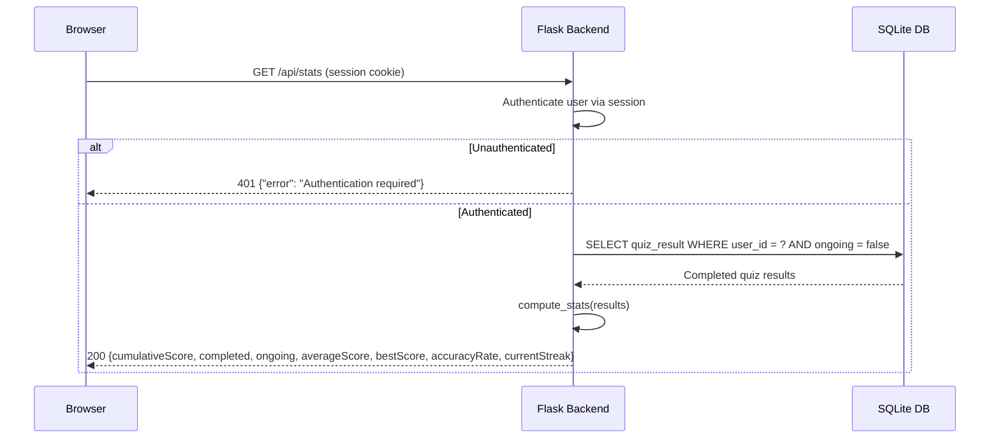

# Design Document: Status Screen Stats

## Overview

This feature extends the existing status screen with richer statistics computed from the `quiz_result` table. Currently, `/api/status` returns three values: quizzes completed, total points, and ongoing quizzes. This design introduces a new `/api/stats` endpoint that computes and returns cumulative score, average score, best score, accuracy rate, and current streak alongside the existing counts. The frontend status screen is updated to display these statistics in dedicated stat cards.

The backend computation is a pure function over the user's completed quiz results — no external services are involved. The statistics formulas are deterministic given the same set of `quiz_result` records, making this feature well-suited for property-based testing of the computation logic.

## Architecture



The architecture follows the existing pattern:
1. A new Flask route `/api/stats` protected by `@login_required`
2. A pure computation function `compute_stats()` that receives a list of quiz result records and returns a statistics dictionary
3. The frontend `showStatusScreen()` function calls the new endpoint and populates stat cards

### Design Decisions

- **Separate endpoint vs extending `/api/status`**: A new `/api/stats` endpoint is introduced rather than modifying the existing `/api/status`. This avoids breaking any code relying on the current shape of the status response, and keeps the stats computation cleanly separated. The frontend will call `/api/stats` instead of `/api/status`.
- **Pure computation function**: The statistics logic is extracted into a standalone `compute_stats(results)` function. This allows direct unit and property testing without needing Flask request context or database fixtures.
- **Ordering for streak**: Current streak is determined by descending `destination_id` order as specified in the requirements. The computation sorts completed results by `destination_id` descending and counts consecutive successes from the most recent.

## Components and Interfaces

### Backend Components

#### `compute_stats(results: list[dict]) -> dict`

A pure function that accepts a list of completed quiz result records (each with `hint_difficulty`, `remaining_guesses`, and `destination_id`) and returns:

```python
{
    "cumulativeScore": int,       # sum of (hint_difficulty * remaining_guesses)
    "quizzesCompleted": int,      # count of completed results
    "averageScore": float,        # cumulativeScore / quizzesCompleted, rounded to 1 decimal
    "bestScore": int,             # max(hint_difficulty * remaining_guesses)
    "accuracyRate": int,          # percentage of results with remaining_guesses > 0, rounded
    "currentStreak": int,         # consecutive recent successes by desc destination_id
}
```

When the input list is empty, all values return 0.

#### `GET /api/stats` Route

- Protected by `@login_required`
- Queries `QuizResult` records for the authenticated user
- Separates completed (ongoing=False) and ongoing records
- Passes completed records to `compute_stats()`
- Adds `quizzesOngoing` count to the response
- Returns JSON response

### Frontend Components

#### Updated `showStatusScreen()`

- Calls `GET /api/stats` instead of `GET /api/status`
- Populates seven stat cards: Cumulative Score, Quizzes Completed, Average Score, Best Score, Accuracy Rate, Current Streak, Ongoing Quizzes
- On fetch failure, all stat cards retain their default "0" value

#### Updated Status Screen HTML

- Replaces the existing three stat cards with seven stat cards
- Each card has a label and a value element with a unique ID for JavaScript population

## Data Models

No new database tables or columns are needed. The feature operates on the existing `quiz_result` table:

| Column | Type | Usage |
|--------|------|-------|
| `user_id` | Integer (FK) | Filter results by authenticated user |
| `destination_id` | Integer (FK) | Determine recency ordering for streak |
| `hint_difficulty` | Integer | Multiplier for score calculation |
| `remaining_guesses` | Integer | Multiplier for score; >0 indicates success |
| `ongoing` | Boolean | Filter: only completed (False) records contribute to stats |

### Computation Formulas

| Statistic | Formula |
|-----------|---------|
| Cumulative Score | `SUM(hint_difficulty × remaining_guesses)` for all completed |
| Average Score | `Cumulative Score / count(completed)`, rounded to 1 decimal |
| Best Score | `MAX(hint_difficulty × remaining_guesses)` among completed |
| Accuracy Rate | `(count where remaining_guesses > 0) / count(completed) × 100`, rounded to nearest integer |
| Current Streak | Count of consecutive completed quizzes (by descending destination_id) where `remaining_guesses > 0` |


## Correctness Properties

*A property is a characteristic or behavior that should hold true across all valid executions of a system — essentially, a formal statement about what the system should do. Properties serve as the bridge between human-readable specifications and machine-verifiable correctness guarantees.*

### Property 1: Score computation correctness

*For any* non-empty list of completed quiz results (each with hint_difficulty in [1,5] and remaining_guesses in [0,3]), the cumulative score SHALL equal the sum of (hint_difficulty × remaining_guesses) for all results, and the average score SHALL equal round(cumulative_score / count, 1).

**Validates: Requirements 1.1, 1.4, 5.3**

### Property 2: Best score is the maximum individual score

*For any* non-empty list of completed quiz results, the best score SHALL equal the maximum value of (hint_difficulty × remaining_guesses) among all results in the list.

**Validates: Requirements 1.5, 5.3**

### Property 3: Accuracy rate formula

*For any* non-empty list of completed quiz results, the accuracy rate SHALL equal round((count of results where remaining_guesses > 0) / total count × 100), and the result SHALL be an integer between 0 and 100 inclusive.

**Validates: Requirements 1.6, 5.3**

### Property 4: Current streak counts consecutive recent successes

*For any* list of completed quiz results with unique destination_ids, when sorted by descending destination_id, the current streak SHALL equal the count of consecutive results from the front of the sorted list where remaining_guesses > 0, stopping at the first result where remaining_guesses equals 0.

**Validates: Requirements 1.7, 5.3**

### Property 5: Ongoing records are excluded from statistics

*For any* mixed list of quiz results (some with ongoing=True, others with ongoing=False), the computed statistics SHALL be identical to computing statistics on only the subset where ongoing=False.

**Validates: Requirements 5.1, 5.2**

### Property 6: Data isolation between users

*For any* two distinct users each with their own quiz results, the statistics returned for user A SHALL be identical to computing statistics from only user A's records, unaffected by user B's records.

**Validates: Requirements 4.2**

## Error Handling

| Scenario | Response |
|----------|----------|
| Unauthenticated request | HTTP 401 `{"error": "Authentication required"}` |
| Database unavailable / query failure | HTTP 500 `{"error": "Unable to retrieve statistics"}` |
| Zero completed quizzes | HTTP 200 with all stats set to 0 (not an error) |

### Frontend Error Handling

- If `GET /api/stats` returns a non-200 response or the fetch throws a network error, the frontend retains the default "0" value for all stat cards (no error popup shown to user).
- The stat card elements are pre-initialized with "0" in the HTML, so failure is invisible to the user.

## Testing Strategy

### Property-Based Tests (Hypothesis)

The project already uses [Hypothesis](https://hypothesis.readthedocs.io/) for property-based testing (present in `pyproject.toml` test dependencies). Each correctness property above maps to one Hypothesis test targeting the pure `compute_stats()` function.

- **Library**: Hypothesis (already in dev dependencies)
- **Minimum iterations**: 100 per property (Hypothesis default `max_examples=100`)
- **Tag format**: Comment `# Feature: status-screen-stats, Property N: <title>`
- **Test file**: `test_backend/test_stats_properties.py`

Each property test generates random lists of quiz result dictionaries using `@st.composite` strategies and verifies the formula invariants against `compute_stats()`.

### Unit Tests (pytest)

Example-based tests for specific scenarios:

- Empty results → all zeros
- Single result with various hint_difficulty/remaining_guesses combinations
- Authentication: unauthenticated request returns 401
- Data isolation: two users, stats only reflect own records
- API parameter rejection: passing `user_id` query param is ignored
- Frontend: stat cards display correct formatting (percent symbol for accuracy)

**Test file**: `test_backend/test_stats_api.py`

### Integration / E2E Tests

- Full flow: register → complete quiz → navigate to status screen → verify stats display
- Verify ongoing quiz is excluded from stats until completed

**Test file**: `test_e2e/test_stats.py`
