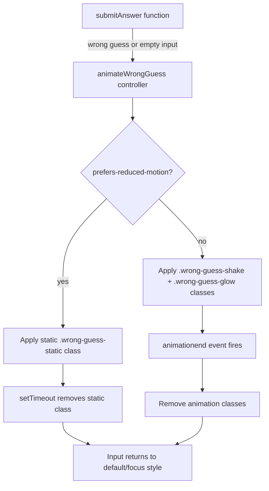

# Design Document: Wrong Guess Animations

## Overview

This feature replaces the JavaScript `alert()` dialogs currently used for wrong-guess and empty-submission feedback with CSS-driven animations on the `#answerInput` element. The animations consist of a horizontal shake and a pulsating red glow that provide immediate, non-blocking visual feedback. The implementation respects `prefers-reduced-motion` for accessibility, falls back to a static red border in that case, and cleanly integrates with the existing focus style (`border-color: #667eea`).

The solution is intentionally minimal: two CSS `@keyframes` declarations, a small JavaScript controller function, and a `prefers-reduced-motion` media query override. No build tools, frameworks, or external dependencies are introduced.

## Architecture



### Design Decisions

1. **CSS classes over inline styles**: Animation state is controlled by adding/removing CSS classes rather than manipulating `element.style`. This keeps the animation definition in CSS (where it belongs) and ensures clean removal leaves zero residual inline styles.

2. **`animationend` event for cleanup**: Rather than coupling removal to a hardcoded `setTimeout`, the controller listens for the `animationend` DOM event. This stays in sync with the actual CSS duration regardless of future duration tweaks.

3. **Re-trigger via class removal + reflow**: To restart an in-progress animation, the controller removes classes, forces a reflow (`void element.offsetWidth`), then re-adds classes. This is the standard browser pattern to restart CSS animations.

4. **Single controller function**: A single exported function `animateWrongGuess(inputElement)` encapsulates all logic. The `submitAnswer()` function calls it in place of `alert()`.

5. **Static fallback for reduced motion**: Instead of playing no animation at all, users with `prefers-reduced-motion` see a static red border for 1 second. This still provides visual feedback without motion.

## Components and Interfaces

### CSS Components

| Component | File | Description |
|-----------|------|-------------|
| `@keyframes shake` | `frontend/style.css` | Horizontal translation keyframes (-10px to +10px, 3 oscillations) |
| `@keyframes redGlow` | `frontend/style.css` | Box-shadow pulse keyframes (red glow fade in/out, 1.5 cycles) |
| `.wrong-guess-shake` | `frontend/style.css` | Class applying the shake animation (600ms) |
| `.wrong-guess-glow` | `frontend/style.css` | Class applying the red glow animation (600ms) |
| `.wrong-guess-static` | `frontend/style.css` | Static red border fallback for reduced-motion users |
| `@media (prefers-reduced-motion: reduce)` | `frontend/style.css` | Disables shake/glow animations entirely |

### JavaScript Components

| Component | File | Description |
|-----------|------|-------------|
| `animateWrongGuess(inputElement)` | `frontend/script.js` | Controller function that applies/removes animation classes |
| Modified `submitAnswer()` | `frontend/script.js` | Calls `animateWrongGuess` instead of `alert()` for wrong/empty cases |

### Interface: `animateWrongGuess(inputElement)`

```javascript
/**
 * Applies wrong-guess animation to the given input element.
 * - If prefers-reduced-motion is active: applies static red border for 1s.
 * - Otherwise: applies shake + glow CSS animations (600ms).
 * - Handles re-triggering if animation is already active.
 * - Cleans up all animation classes/styles on completion.
 *
 * @param {HTMLInputElement} inputElement - The input to animate
 */
function animateWrongGuess(inputElement) { ... }
```

## Data Models

This feature is entirely client-side and introduces no new data models, API endpoints, or database changes. The only state is transient DOM state (presence/absence of CSS classes on `#answerInput`).

### Transient State

| State | Representation | Lifetime |
|-------|---------------|----------|
| Animation active | `.wrong-guess-shake` and/or `.wrong-guess-glow` classes present | 600ms (animation duration) |
| Static fallback active | `.wrong-guess-static` class present | 1000ms (setTimeout) |
| No animation | No animation classes present | Default resting state |

## Correctness Properties

*A property is a characteristic or behavior that should hold true across all valid executions of a system — essentially, a formal statement about what the system should do. Properties serve as the bridge between human-readable specifications and machine-verifiable correctness guarantees.*

### Property 1: Whitespace-only input triggers animation, not API call

*For any* string composed entirely of whitespace characters (spaces, tabs, newlines, zero-width spaces, etc.), when that string is the value of `#answerInput` and the user activates submit, the Animation_Controller SHALL trigger the wrong-guess animation and SHALL NOT make a fetch call to the check-answer API.

**Validates: Requirements 3.4**

### Property 2: Re-trigger always restarts animation

*For any* number N ≥ 1 of rapid successive calls to `animateWrongGuess(inputElement)`, after the last call completes (synchronously), the animation CSS classes (`.wrong-guess-shake` and `.wrong-guess-glow`) SHALL be present on the element — meaning the animation has restarted regardless of prior animation state.

**Validates: Requirements 4.2, 2.5**

### Property 3: Animation cleanup preserves input state and leaves no residual styling

*For any* string value V in the input element and *for any* number of animation trigger-and-complete cycles, after the `animationend` event fires the element's `.value` SHALL equal V, the element SHALL NOT be disabled, the element SHALL be focusable, and the element SHALL have zero animation-related inline style attributes (no `transform`, `box-shadow`, or `border-color` in `element.style`).

**Validates: Requirements 4.3, 6.4**

## Error Handling

This feature has minimal error surface since it's purely client-side DOM manipulation:

| Scenario | Handling |
|----------|----------|
| `#answerInput` element not found | `animateWrongGuess` returns immediately (no-op) if passed a falsy element |
| `animationend` event never fires (browser bug) | Defensive `setTimeout` at 1000ms as a fallback cleanup to remove classes |
| `matchMedia` not supported | Treat as "no preference" — play full animations (graceful degradation) |
| Rapid re-triggers cause reflow thrashing | Single `void element.offsetWidth` reflow is negligible; no mitigation needed |

The controller function does not throw exceptions. All DOM operations are wrapped in existence checks.

## Testing Strategy

### Unit Tests (Jasmine)

Unit tests cover specific examples, edge cases, and integration points:

- Calling `animateWrongGuess` adds both `.wrong-guess-shake` and `.wrong-guess-glow` classes
- Firing `animationend` removes both animation classes
- With `prefers-reduced-motion` mocked, only `.wrong-guess-static` is applied (no shake/glow)
- Re-triggering mid-animation restarts the animation (classes re-applied)
- Empty string submission calls `animateWrongGuess` instead of `alert()`
- After animation ends with focus, border-color returns to `#667eea`
- After animation ends without focus, border-color returns to `#ddd`
- Input remains enabled and focusable during animation
- The `alert()` function is never called in the wrong-guess or empty-submission paths

### Property-Based Tests (fast-check)

Property-based tests verify universal correctness properties using [fast-check](https://github.com/dubzzz/fast-check) with jsdom for DOM simulation:

- **Minimum 100 iterations** per property test
- Each test is tagged with a comment referencing the design property

| Property | Test Description | Generator |
|----------|-----------------|-----------|
| Property 1 | Whitespace-only strings trigger animation, not fetch | `fc.stringOf(fc.constantFrom(' ', '\t', '\n', '\r', '\u00A0', '\u2003'))` |
| Property 2 | N rapid calls always leave animation classes present | `fc.integer({min: 1, max: 50})` for call count |
| Property 3 | Any input value is preserved after animation cycle | `fc.string()` for arbitrary input values |

**Tag format**: `// Feature: wrong-guess-animations, Property {N}: {description}`

### End-to-End Tests (Playwright)

E2E tests in `test_e2e/` verify the full integration in a real browser:

- Submit wrong answer → input shakes and glows (visual check via class presence)
- Submit empty input → animation plays, no alert dialog appears
- Animation ends → classes removed, input usable
- With `prefers-reduced-motion` emulated → no motion, static red border only

