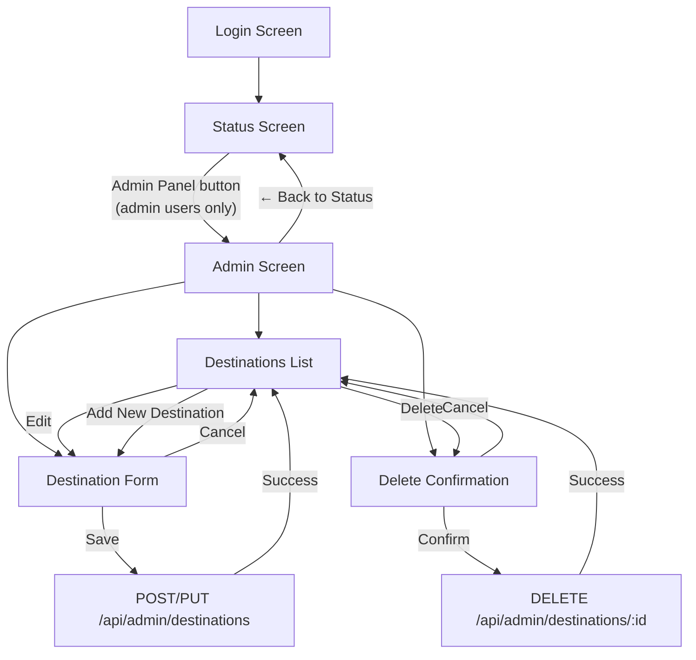
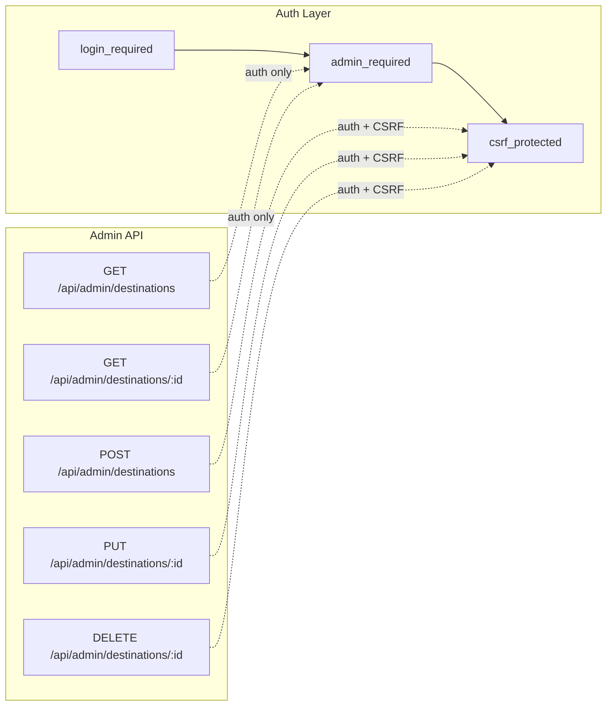

# Admin Page

The admin page allows users with the `is_admin` flag to manage quiz destinations through a browser-based interface.

## Navigation Flow



## API Endpoints



| Method | Endpoint | Auth | CSRF | Description |
|--------|----------|------|------|-------------|
| GET | `/api/admin/destinations` | admin | No | List all destinations (id + name) |
| GET | `/api/admin/destinations/:id` | admin | No | Get full destination data |
| POST | `/api/admin/destinations` | admin | Yes | Create a new destination |
| PUT | `/api/admin/destinations/:id` | admin | Yes | Replace all fields of a destination |
| DELETE | `/api/admin/destinations/:id` | admin | Yes | Delete destination + cascade results |

## Screen Layout

```
┌─────────────────────────────────────────────────────┐
│  🔧 Admin: Quiz Management        [← Back to Status]│
├─────────────────────────────────────────────────────┤
│  Total destinations: 3                               │
│  [Add New Destination]                               │
│                                                      │
│  ┌─────────────────────────────────────────────────┐ │
│  │ #1  Paris                        [Edit] [Delete]│ │
│  ├─────────────────────────────────────────────────┤ │
│  │ #2  Tokyo                        [Edit] [Delete]│ │
│  ├─────────────────────────────────────────────────┤ │
│  │ #3  New York                     [Edit] [Delete]│ │
│  └─────────────────────────────────────────────────┘ │
└─────────────────────────────────────────────────────┘
```

## Destination Form

```
┌─────────────────────────────────────────────────────┐
│  Add New Destination / Edit Destination              │
├─────────────────────────────────────────────────────┤
│  Name:      [________________________]               │
│                                                      │
│  Hint 1:    [________________________]               │
│  Hint 2:    [________________________]               │
│  Hint 3:    [________________________]               │
│  Hint 4:    [________________________]               │
│  Hint 5:    [________________________]               │
│                                                      │
│  Image URLs (2–10):                                  │
│    [https://example.com/img1.jpg        ] [✕]        │
│    [https://example.com/img2.jpg        ] [✕]        │
│    [+ Add Image URL]                                 │
│                                                      │
│  Correct Answers (1–20):                             │
│    [paris                               ] [✕]        │
│    [paris, france                       ] [✕]        │
│    [+ Add Answer]                                    │
│                                                      │
│  [Save]  [Cancel]                                    │
└─────────────────────────────────────────────────────┘
```

## Validation Rules

| Field | Constraints |
|-------|-------------|
| Name | 1–128 characters, not blank |
| Hints | Exactly 5, each 1–256 characters, not blank |
| Images | 2–10 URLs, each must start with `http://` or `https://` |
| Correct Answers | 1–20 items, each 1–128 characters |

Answers are normalized (lowercased + trimmed) before storage.

## Error Responses

| Status | Condition |
|--------|-----------|
| 401 | Not authenticated |
| 403 | Not admin, or missing/invalid CSRF token |
| 400 | Validation failure (details in response) |
| 404 | Destination not found |
| 409 | Duplicate destination name |
