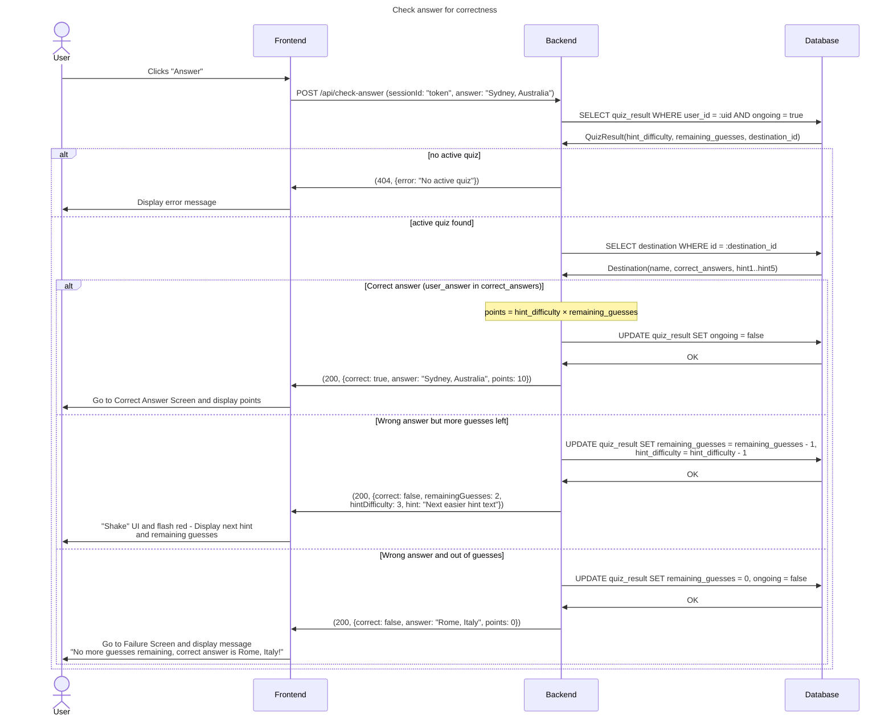

```mermaid
sequenceDiagram
    title Check answer for correctness

    actor User
    participant Frontend
    participant Backend
    participant Database

    User->>Frontend: Clicks "Answer"
    Frontend->>Backend: POST /api/check-answer (sessionId: "token", answer: "Sydney, Australia")

    Backend->>Database: SELECT quiz_result WHERE user_id = :uid AND ongoing = true
    Database->>Backend: QuizResult(hint_difficulty, remaining_guesses, destination_id)

    alt no active quiz
        Backend->>Frontend: (404, {error: "No active quiz"})
        Frontend->>User: Display error message
    else active quiz found
        Backend->>Database: SELECT destination WHERE id = :destination_id
        Database->>Backend: Destination(name, correct_answers, hint1..hint5)

        alt Correct answer (user_answer in correct_answers)
            Note over Backend: points = hint_difficulty × remaining_guesses
            Backend->>Database: UPDATE quiz_result SET ongoing = false
            Database->>Backend: OK
            Backend->>Frontend: (200, {correct: true, answer: "Sydney, Australia", points: 10})
            Frontend->>User: Go to Correct Answer Screen and display points
        else Wrong answer but more guesses left
            Backend->>Database: UPDATE quiz_result SET remaining_guesses = remaining_guesses - 1,<br/>hint_difficulty = hint_difficulty - 1
            Database->>Backend: OK
            Backend->>Frontend: (200, {correct: false, remainingGuesses: 2,<br/>hintDifficulty: 3, hint: "Next easier hint text"})
            Frontend->>User: "Shake" UI and flash red - Display next hint<br/>and remaining guesses
        else Wrong answer and out of guesses
            Backend->>Database: UPDATE quiz_result SET remaining_guesses = 0, ongoing = false
            Database->>Backend: OK
            Backend->>Frontend: (200, {correct: false, answer: "Rome, Italy", points: 0})
            Frontend->>User: Go to Failure Screen and display message<br/>"No more guesses remaining, correct answer is Rome, Italy!"
        end
    end
```
