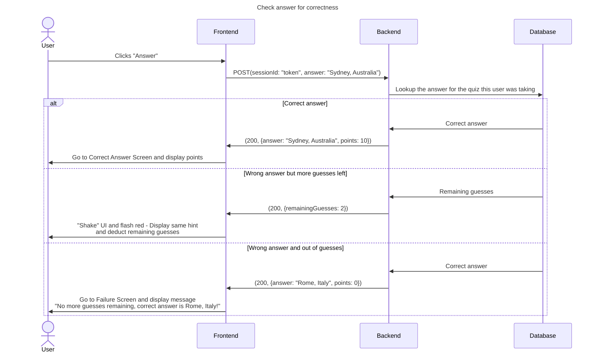

```mermaid
sequenceDiagram
    title Check answer for correctness

    actor User
    participant Frontend
    participant Backend
    participant Database

    User->>Frontend: Clicks "Answer"
    Frontend->>Backend: POST(sessionId: "token", answer: "Sydney, Australia")
    Backend->>Database: Lookup the answer for the quiz this user was taking

    alt Correct answer
        Database->>Backend: Correct answer
        Backend->>Frontend: (200, {answer: "Sydney, Australia", points: 10})
        Frontend->>User: Go to Correct Answer Screen and display points
    else Wrong answer but more guesses left
        Database->>Backend: Remaining guesses
        Backend->>Frontend: (200, {remainingGuesses: 2})
        Frontend->>User: "Shake" UI and flash red - Display same hint<br/>and deduct remaining guesses
    else Wrong answer and out of guesses
        Database->>Backend: Correct answer
        Backend->>Frontend: (200, {answer: "Rome, Italy", points: 0})
        Frontend->>User: Go to Failure Screen and display message<br/>"No more guesses remaining, correct answer is Rome, Italy!"
    end
```
