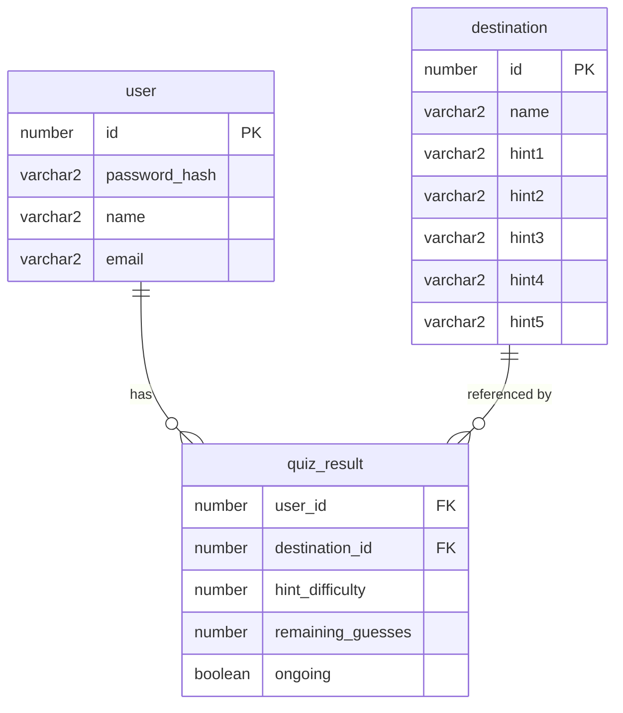

```mermaid
erDiagram
    destination {
        number id PK
        varchar2 name
        varchar2 hint1
        varchar2 hint2
        varchar2 hint3
        varchar2 hint4
        varchar2 hint5
    }

    user {
        number id PK
        varchar2 password_hash
        varchar2 name
        varchar2 email
    }

    quiz_result {
        number user_id FK
        number destination_id FK
        number hint_difficulty
        number remaining_guesses
        boolean ongoing
    }

    user ||--o{ quiz_result : "has"
    destination ||--o{ quiz_result : "referenced by"
```
