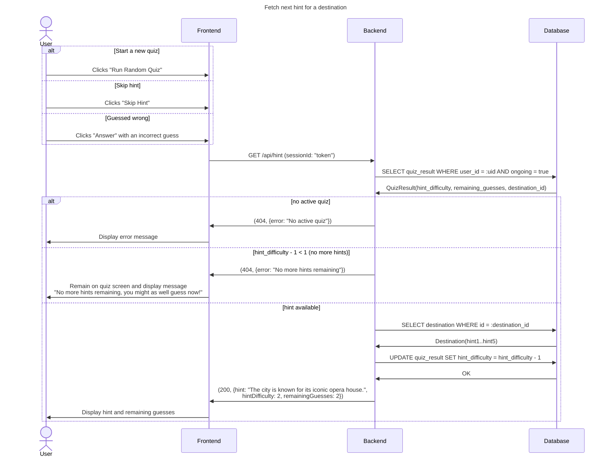

```mermaid
sequenceDiagram
    title Fetch next hint for a destination

    actor User
    participant Frontend
    participant Backend
    participant Database

    alt Start a new quiz
        User->>Frontend: Clicks "Run Random Quiz"
    else Skip hint
        User->>Frontend: Clicks "Skip Hint"
    else Guessed wrong
        User->>Frontend: Clicks "Answer" with an incorrect guess
    end

    Frontend->>Backend: GET /api/hint (sessionId: "token")

    Backend->>Database: SELECT quiz_result WHERE user_id = :uid AND ongoing = true
    Database->>Backend: QuizResult(hint_difficulty, remaining_guesses, destination_id)

    alt no active quiz
        Backend->>Frontend: (404, {error: "No active quiz"})
        Frontend->>User: Display error message
    else hint_difficulty - 1 < 1 (no more hints)
        Backend->>Frontend: (404, {error: "No more hints remaining"})
        Frontend->>User: Remain on quiz screen and display message<br/>"No more hints remaining, you might as well guess now!"
    else hint available
        Backend->>Database: SELECT destination WHERE id = :destination_id
        Database->>Backend: Destination(hint1..hint5)
        Backend->>Database: UPDATE quiz_result SET hint_difficulty = hint_difficulty - 1
        Database->>Backend: OK
        Backend->>Frontend: (200, {hint: "The city is known for its iconic opera house.",<br/>hintDifficulty: 2, remainingGuesses: 2})
        Frontend->>User: Display hint and remaining guesses
    end
```
