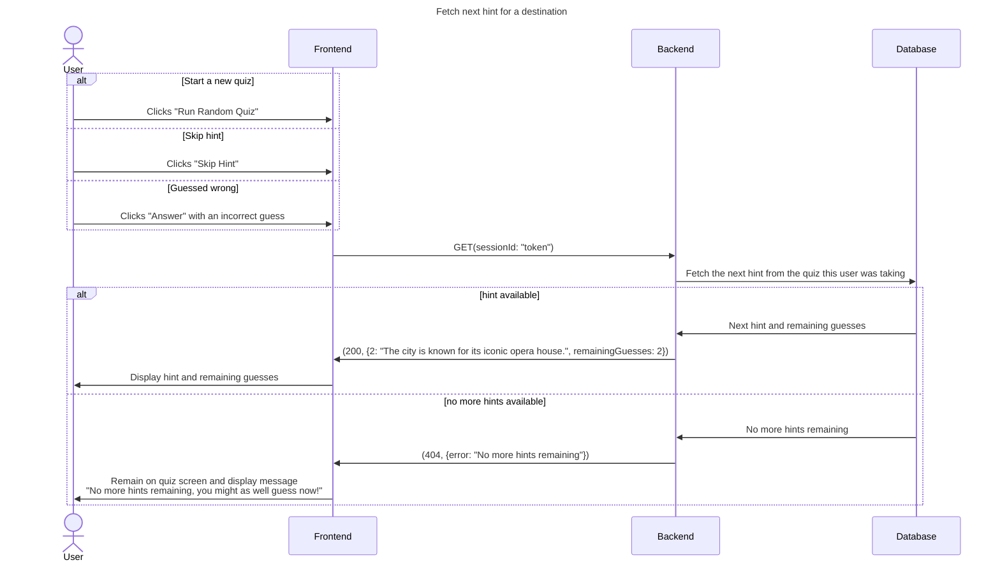

```mermaid
sequenceDiagram
    title Fetch next hint for a destination

    actor User
    participant Frontend
    participant Backend
    participant Database

    alt Start a new quiz
        User->>Frontend: Clicks "Run Random Quiz"
    else Skip hint
        User->>Frontend: Clicks "Skip Hint"
    else Guessed wrong
        User->>Frontend: Clicks "Answer" with an incorrect guess
    end

    Frontend->>Backend: GET(sessionId: "token")
    Backend->>Database: Fetch the next hint from the quiz this user was taking

    alt hint available
        Database->>Backend: Next hint and remaining guesses
        Backend->>Frontend: (200, {2: "The city is known for its iconic opera house.", remainingGuesses: 2})
        Frontend->>User: Display hint and remaining guesses
    else no more hints available
        Database->>Backend: No more hints remaining
        Backend->>Frontend: (404, {error: "No more hints remaining"})
        Frontend->>User: Remain on quiz screen and display message<br/>"No more hints remaining, you might as well guess now!"
    end
```
