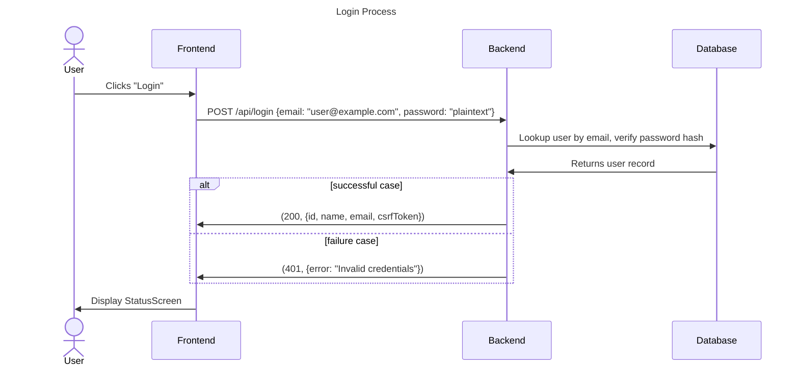

```mermaid
sequenceDiagram
    title Login Process

    actor User
    participant Frontend
    participant Backend
    participant Database

    User->>Frontend: Clicks "Login"
    Frontend->>Backend: POST /api/login {email: "user@example.com", password: "plaintext"}
    Backend->>Database: Lookup user by email, verify password hash
    Database->>Backend: Returns user record

    alt successful case
        Backend->>Frontend: (200, {id, name, email, csrfToken})
    else failure case
        Backend->>Frontend: (401, {error: "Invalid credentials"})
    end

    Frontend->>User: Display StatusScreen
```
