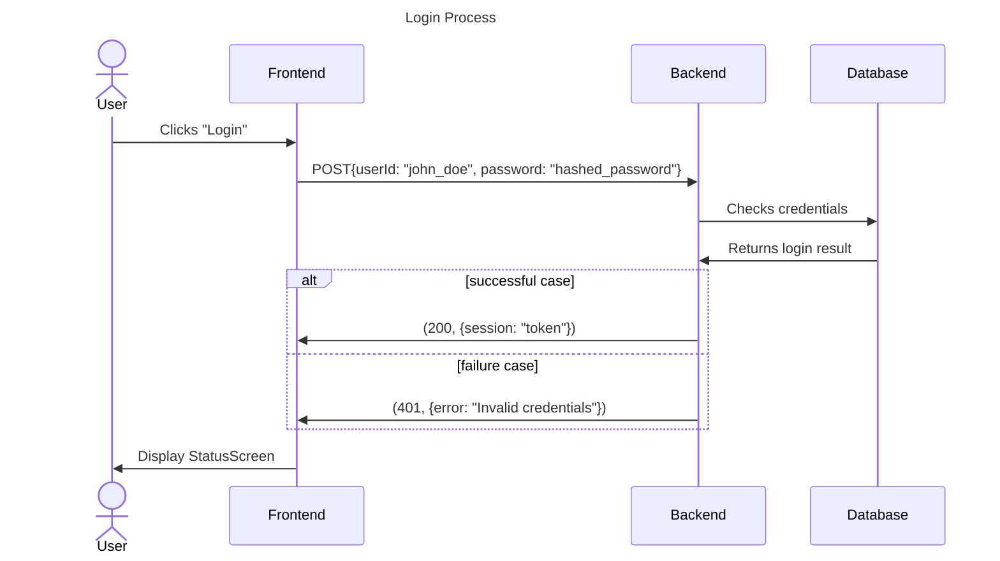

```mermaid
sequenceDiagram
    title Login Process

    actor User
    participant Frontend
    participant Backend
    participant Database

    User->>Frontend: Clicks "Login"
    Frontend->>Backend: POST{userId: "john_doe", password: "hashed_password"}
    Backend->>Database: Checks credentials
    Database->>Backend: Returns login result

    alt successful case
        Backend->>Frontend: (200, {session: "token"})
    else failure case
        Backend->>Frontend: (401, {error: "Invalid credentials"})
    end

    Frontend->>User: Display StatusScreen
```
