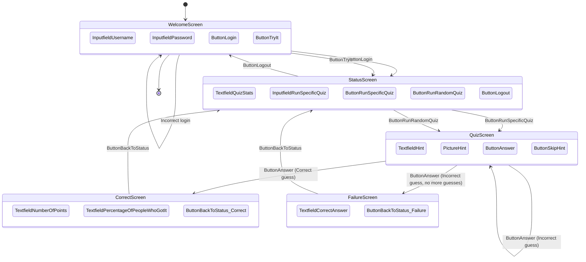

```mermaid
stateDiagram-v2
    [*] --> WelcomeScreen
    WelcomeScreen --> WelcomeScreen: Incorrect login
    WelcomeScreen --> StatusScreen: ButtonLogin
    WelcomeScreen --> StatusScreen: ButtonTryIt
    WelcomeScreen --> [*]

    state WelcomeScreen {
        InputfieldUsername
        InputfieldPassword
        ButtonLogin
        ButtonTryIt
    }

    StatusScreen --> QuizScreen: ButtonRunSpecificQuiz
    StatusScreen --> QuizScreen: ButtonRunRandomQuiz
    StatusScreen --> WelcomeScreen: ButtonLogout

    state StatusScreen {
        TextfieldQuizStats
        InputfieldRunSpecificQuiz
        ButtonRunSpecificQuiz
        ButtonRunRandomQuiz
        ButtonLogout
    }

    QuizScreen --> QuizScreen: ButtonSkipHint
    QuizScreen --> QuizScreen: ButtonAnswer (Incorrect guess)
    QuizScreen --> CorrectScreen: ButtonAnswer (Correct guess)
    QuizScreen --> FailureScreen: ButtonAnswer (Incorrect guess, no more guesses)

    state QuizScreen {
        TextfieldHint
        PictureHint
        ButtonAnswer
        ButtonSkipHint
    }

    CorrectScreen --> StatusScreen: ButtonBackToStatus

    state CorrectScreen {
        TextfieldNumberOfPoints
        TextfieldPercentageOfPeopleWhoGotIt
        ButtonBackToStatus_Correct
    }

    FailureScreen --> StatusScreen: ButtonBackToStatus

    state FailureScreen {
        TextfieldCorrectAnswer
        ButtonBackToStatus_Failure
    }
```
